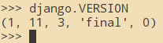
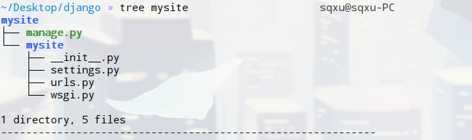
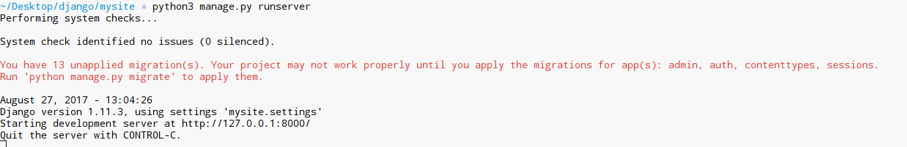
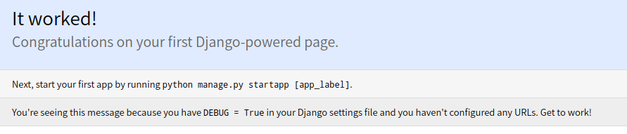
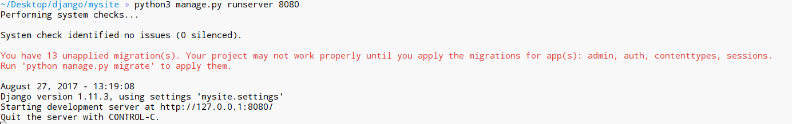

#django学习笔记
按部就班，跟着官方文档一步一步来。
##Writing your first Django app, part 1
首先查看django版本
````python
import django
django.VERSION
````


接着我们创建一个工程
````shell
django-admin startproject mysite
````
这样我们就创建好了一个工程，我们来看一下这个工程的目录结构：

```shell
tree mysite
```


如上图所示，根目录*mysite*是存放项目的容器，可以在任意时候重命名.

现在试一下命令：
````shell
python3 manage.py runserver
````



这个时候，我们已经用上了django的开发服务器，顾名思义，首先它是一个服务器，就像Apache一样，第二，它只适合用于开发。注意不要在生产环境中使用这个服务器。

现在我们打开网站[http://127.0.0.1:8000](http://127.0.0.1:8000),效果如图:



注：１.如果要改变服务器端口则:

````shell
python3 manage.py runserver 8080
````

2.如果要更改ip则：
````shell
python3 manage.py runserver ip:8000
````
